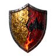

<p align="center">
  
</p>

# Grudgelands

**An open-source multiplayer voxel RPG for [Luanti](https://www.luanti.org/).**
Explore, build and craft in an open world, with classes, quests and character
progression inspired by classic MMORPGs. Grudgelands brings together ideas
from the Luanti community's games and mods into a shared fantasy adventure.

**[Play in your browser at kaesual.com](https://kaesual.com)** ·
[Install locally](#play-with-luanti) · [Roadmap](#whats-ahead)

> **Playable and in active development.** The first release is still being
> built. Expect rough edges, changing balance and development-world resets.

## What you can play today

- **Four classes, different ways to fight.** Play a Warrior, Mage, Priest or
  Scout, with melee, spells, healing or a bow and blade. Each class has two
  talent trees to shape its abilities as you level toward 60.
- **An open world to explore and change.** Travel through named regions,
  forests, mountains and caves; gather resources, dig and build outside
  protected places. Six starting towns and six capitals give each people
  its own home, architecture and surroundings.
- **Quests and character progression.** Follow your starting town's stories,
  help local inhabitants and take on stronger enemies. The current catalog
  contains 240 quests across starts, capitals and named regions,
  with a journal, quest tracker and world atlas to help you find your way.
- **Crafting and equipment.** Make basic gear, choose two of seven primary
  professions, and improve your equipment with enchantments. Weaponsmith,
  Armorsmith, Alchemist, Tailor, Leatherworker, Woodcarver and Goldsmith each
  have their own recipes; Cooking is available alongside them.
- **Life between adventures.** Grow crops, go fishing, prepare food, visit
  vendors and save for a mount. Bind your home at an innkeeper so you can
  return after a journey.
- **Adventure together.** Choose one of two factions and six peoples, then
  form a party with up to ten players of your faction. Party health displays
  and atlas markers help you stay together while exploring and fighting.

The Accord and the Throng live on rival continents, divided by an old
conflict. A rising threat beneath the world gives both sides something else
to fear. Their story will grow as more regions and encounters are completed.

## Current State

*Last updated: 2026-09-24. Based on [BACKLOG.md](BACKLOG.md) and
[ROADMAP.md](ROADMAP.md).*

The systems above are implemented and installed in the local development build.
Round 20 adds authored compositions for the remaining 70 POI art slots,
parallel starter errands, destination conversations and more regional quests.
It also aligns class equipment permissions, broken-item appearance and
contextual skill combat/digging; right-click holds draw bows or consume food.
Playtesting, balancing and finishing the wider world remain ongoing; implemented features are not all
fully playtested. [Round 18](docs/research/round18-completion.md) completes the
latest usability, progression, pursuit, tool and preparation fixes.
[Round 19](docs/research/round19-completion.md) adds atlas zoom/scroll, concise
menus, first-click talents, top-center buffs and readable dragon bars.
Its [UI follow-up](docs/research/round19-ui-followup.md) keeps Map at the shared
window size and makes talent buttons and text alignment clearer.
The [combat follow-up](docs/research/round19-pursuit-followup.md) keeps ambient
mobs attacking stationary targets and restores idle enemies after a safe quiet period.

Open-world housing claims, boats, the full geographic PvP system, war fronts
and the planned island dragon encounters are still unfinished. The current
quest catalog does not yet cover the full journey through every region.

<details>
<summary>Development tracking and known caveats</summary>

**Delivered:** 27 of 53 tracked work-package identities are complete; several
others have playable portions. This is a tracking count, not a percentage of
game completion. The latest delivered increment is
[Round 20](docs/research/round20-completion.md), independently reviewed and
locally synchronized; [project status](docs/STATUS.md) records acceptance. No remote
delivery is claimed. [In-game acceptance](docs/research/round20-playtest.md)
remains separate.

**Ready for further work:** the backlog identifies crafting/enchantment
completion, carried light, recovery/rest and economy calibration as available
next work. Housing, travel and the wider PvP/endgame content have additional
dependencies; the [roadmap](ROADMAP.md) records their order.

**Caveats:** the confusing Cooking feedback now has a distinct success message;
the trainer flows still need in-game acceptance. Held-torch moving light and
friendly-guard healing remain deferred. Performance and first-release validation
are still open. Optional full-world preparation can
take many hours; the atlas does not require it. See the
[latest playtest checklist](docs/research/round18-playtest.md) and the
[preceding checks](docs/research/round17-playtest.md).

</details>

## What's ahead

The [full roadmap](ROADMAP.md) separates planned features from delivered work.
There are no fixed release dates yet.

- **Toward the first release:** protected player homes, boats and travel,
  more settlements and regional quests, geographic PvP and faction clashes,
  and completing the two offshore dragon encounters. Economy balance and
  reliable everyday play are part of that work too.
- **Later adventures:** a walkable underworld expansion with its own story,
  creatures and terrain. Other plans include further classes, dungeons,
  regional bosses, reputation and player trading.
- **Continued refinement:** clearer onboarding, accessibility, localization,
  art and sound, and multiplayer performance.

## Play with Luanti

You can try the current version **[in your browser](https://kaesual.com)**,
or run the game locally with Luanti. Grudgelands is a standalone game with
its dependencies bundled; no client mod is required.

For a local world, place this repository in your Luanti `games/` directory
as `grudgelands`, then select it when creating a **new world**. The game uses
mapgen **v7**. Development uses Luanti **5.17.0-dev**; compatibility with older
versions has not been established.

<details>
<summary>Local development setup</summary>

For the Flatpak installation used in development, run this from the repository
root to copy the game into Luanti's game directory:

```sh
tools/sync_to_luanti.sh
```

For source-based development, also fetch the pinned reference projects:

```sh
git submodule update --init --recursive --depth 1
```

These reference checkouts are for development only; playing does not require
them. See the [reference-project guide](docs/reference_projects.md) and
[project conventions](AGENTS.md).

</details>

## Feedback and contributions

Try a class, follow a few quests or explore with a friend. Feedback about
confusing moments, combat, pacing and places worth exploring is especially
useful. When reporting a bug, include what you were doing, your game version
and whether you played through the browser or a native Luanti client.

Code, artwork, sound and design feedback are welcome. For a larger change,
start with a discussion of the idea and check the
[design documents](docs/design/README.md) and [backlog](BACKLOG.md).

## The person and tools behind it

I'm Jan, the designer behind Grudgelands. I use AI extensively for development
and some artwork, while shaping the game through hands-on planning,
playtesting, review and repeated iteration. Making sandbox freedom and RPG
progression work together takes many small decisions, experiments and
revisions. This is a project I care deeply about, and I remain responsible
for its direction and what goes into it.

## Built on community work

Grudgelands would not be possible without Luanti and the people who have
spent years building its games, mods and tools. Their care, creativity and
shared knowledge are a large part of its foundation. The project draws on
both reference implementations and openly licensed code and artwork from
projects such as Minetest Game, VoxeLibre, Lord of the Test,
Mobs Redo, Animalia, Animal World and many others.

The [reference-project list](docs/reference_projects.md) links to the projects
we study; [VENDOR.md](VENDOR.md) records the code we ship and our changes.
Media authors, sources and licenses are documented alongside the assets in
per-mod license files.

## Support development

If you enjoy Grudgelands and would like to support its continued development,
you can **[buy me a coffee](https://buymeacoffee.com/kaesual)**. Thank you for
playing, sharing feedback or helping in whatever way suits you.

## Explore the design

The [design index](docs/design/README.md) contains the decided game rules.
Some describe systems still being built; the [backlog](BACKLOG.md) tracks
implementation, and [research notes](docs/research/) retain the supporting
investigations and delivery records.

<details>
<summary>Browse the game design</summary>

| Area | Design documents |
|------|------------------|
| World and places | [World](docs/design/world.md): geography and world rules; [zones](docs/design/world_zones.md): regions and level ranges; [settlements](docs/design/settlements.md): towns and capitals; [story](docs/design/story.md): factions and the campaign. |
| Characters and combat | [Classes](docs/design/classes.md): abilities and resources; [Scout](docs/design/scout.md): bow and blade; [combat](docs/design/combat_stats.md): damage and defenses; [visuals](docs/design/character_visuals.md): peoples and equipment appearance. |
| Progression and quests | [Progression](docs/design/progression.md): levels and rewards; [talents](docs/design/skill_trees.md): character builds; [quests](docs/design/quests.md): objectives, journal and credit. |
| Items and crafting | [Items](docs/design/items_crafting.md): materials and recipes; [professions](docs/design/professions.md): trades; [stations and enchantments](docs/design/crafting_equipment_revision.md): current crafting rules; [equipment](docs/design/inventory_equipment.md): slots and bags; [durability](docs/design/durability_repair.md): wear and repair; [economy](docs/design/economy.md): money, prices and services. |
| Wildlife and everyday life | [Biomes and mobs](docs/design/biomes_mobs.md): habitats and creatures; [farming](docs/design/farming.md): crops; [housing](docs/design/housing.md): planned homes and claims. |
| Travel and playing together | [Mounts](docs/design/mounts.md): riding; [boats](docs/design/boats.md): planned water travel; [home travel](docs/design/home_travel.md): innkeepers and return; [parties](docs/design/parties.md): groups; [atlas](docs/design/world_map.md): maps and markers. |
| Current revision | [Round 18 decisions](docs/design/playtest_quality_revision.md): implemented playtest-quality rules; GUI acceptance pending. |
| Hosting | [World preparation](docs/design/world_preparation.md): generating starting areas or the full world. |

</details>

## License

Grudgelands' own code is **GPL-3.0-or-later** ([LICENSE.txt](LICENSE.txt)).
The combined game is **GPL-3.0-only** because it includes GPL-3.0-only code
from cottages; see the [license overview](docs/research/licensing.md).

Media retain their individual licenses, documented per mod: CC0, CC BY,
CC BY-SA or GPL, as applicable. The
[Grudgelands crest](menu/LICENSE-media.md) is CC0.
