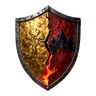

<p align="center">
  
</p>

# Grudgelands

**An open-source multiplayer voxel RPG for [Luanti](https://www.luanti.org/).**
Explore, build and craft in an open world, with classes, quests and character
progression inspired by classic MMORPGs. Grudgelands brings together ideas
from the Luanti community's games and mods into a shared fantasy adventure.

**[Play in your browser at kaesual.com](https://kaesual.com)** ·
[Install locally](#play-with-luanti) · [Getting started](#getting-started) ·
[Changelog](CHANGELOG.md) · [Discord](https://discord.gg/M4auM7yunk)

> **Playable and in active development.** The first release is still being
> built. Expect rough edges, changing balance and development-world resets.

## What you can play today

- **Four classes, different ways to fight.** Play a Warrior, Mage, Priest or
  Scout, with melee, spells, healing or a bow and blade. Each class has two
  talent trees to shape its abilities as you level toward 60.
- **An open world to explore and change.** Travel through named regions,
  forests, mountains and caves; gather resources, dig and build outside
  protected places. Six starting towns and six capitals give each people
  its own home, architecture and surroundings. Deeper stone is harder and
  needs a better pick, and the creatures underground grow stronger with
  depth.
- **Quests and character progression.** Follow your starting town's stories,
  help local inhabitants and take on stronger enemies. More than 500 quests
  lead each people from its starting town through its homelands and the
  contested borderlands to the war front at level 60, with repeatable
  bounties, a journal, quest tracker, world atlas and minimap to help you
  find your way. From level 41 each faction's main story follows a
  burning debt across the front to a shared finale for a small party.
- **Bosses.** Two dragons on their own islands at level 60, a king on the
  throne of each capital, a General in each faction's fortress and
  Isquarre the Tithe-Eater at a rift on the front. Each boss drops two
  blue or gold items for you once a day; within that day you can still
  help others kill it (Isquarre then drops what an elite drops).
- **Crafting and equipment.** Pick a recipe from a list on the Crafting
  tab and let the job run, even while you are away. Choose two of six
  primary professions, which make all the gear, and improve your
  equipment with enchantments and upgrades. Weaponsmith, Armorsmith,
  Tailor, Leatherworker, Woodcarver and Goldsmith each have their own
  recipes and station; everyone knows Cooking, and Alchemy is available
  alongside them. Creatures drop white, blue and gold gear, and a Fallen
  Crown lifts an item beyond its tier.
- **Life between adventures.** Grow crops, go fishing, prepare food and
  visit vendors. Learn to ride at level 15 and to fly at level 45 at your
  capital's stable, where a Shipwright sells boats from level 15, the way
  to the dragon islands. Bind your home at an innkeeper so you can return
  after a journey, and travel between the waystones of your faction's towns.
- **A home of your own.** From level 20 the Housing Steward in your capital
  gives you a Claim Stone: a protected 101 × 101 plot in your faction's
  level 11–30 lands (not in a capital's zone), kept running with coal or
  charcoal, with access for the friends you choose.
- **Adventure together.** Choose one of two factions and one of six
  peoples (Human, Dwarf or Elf for The Accord; Orc, Troll or Undead for
  The Throng), shape your character's look, earn cloaks through achievements, then form a
  party with up to ten players of your faction. Party health displays and
  atlas markers help you stay together while exploring and fighting.
- **A world you can hear.** Creatures, spells, crafting and the people you
  talk to have their own sounds; every region has a quiet ambience by day
  and night, hearths crackle and rivers run, and each capital has its own calm
  music.
- **Fight the other faction when you choose to.** Contested lands and enemy
  territory flag you for PvP, a button flags you anywhere, and only two
  flagged players can harm each other. The other faction's kings, Generals
  and guards attack you whatever your flag. Each faction holds a fortress
  at the front and sends its players to raid the enemy's war camps.

The Accord and The Throng live on rival continents, Elandor and Kragmar,
divided by an old conflict. A rising threat beneath the world gives both
sides something else to fear: coins branded with its mark buy the dead of
both armies, and each faction hunts the payers on its own until the
collector itself takes shape at a rift on the front. What waits below is a
story for a later expansion.

## Getting started

The **Help** tab in your inventory (press `I`) is the full guide: first
steps, quest symbols, professions, ores and depth, the formulas behind your
stats, and the sound controls. The short version:

- **Create your character** in one window: faction, people, class and
  look. On a new world a window first shows how far the game has prepared
  the starting areas; character creation opens when they are ready.
- **Fight with skills, not the hotbar weapon.** Your starter weapon is
  already equipped in the hand slots of the Character tab. Open the
  Talents & Skills tab, drag a combat skill onto your hotbar, select it
  and left-click a creature. Holding the left button digs, and fights a
  creature that walks into your aim.
- **Quests:** a yellow `!` above someone means a new quest, a yellow `?`
  one ready to hand in. Right-click to talk. `Z` opens the map with your
  quest log and shows where a quest's targets are.
- **Around level 10** your start town sends you on to your people's
  capital: trainers for every profession, riding, repairs and new quests.
- **Getting home:** set your home at an innkeeper; Return home on the
  Character tab or in the quickbar (`E`, also your mounts, boats and
  potions) takes you back every 30 minutes. Dying costs no items,
  money or XP; you respawn at your home.
- **Flying mounts** climb with Jump and descend with Sneak.
- **Sound:** Help → Sound, or `/music 50`, `/music off`, `/ambience off`
  in chat. Other commands: `/char` (your character), `/talents` (your
  trees), `/money`, `/xp`.

## Current state

*Last updated: 2026-10-09. The current version is the newest entry of the
[changelog](CHANGELOG.md) and shows on Help → About.*

The latest finished round is Round 45 (0.45.0), "Crafting rework":
recipe lists in areas on the Crafting tab instead of the crafting grid and
the recipe books, crafting as timed jobs that finish while you are away,
all gear made by the professions at stations nearby, a new item level
ladder, enchants and upgrades as jobs, Cooking known from the start,
finished potions at the brewing stand and Grudge-Free Repairs in every
start town and capital; from its playtest a tidier inventory with your
money above the hotbar, mounts you see in first person, rides that end
in water or lava, and your Claim Stone as a waypoint. A host runs the
migration tool once on the stopped world: it removes old alchemy
mixtures, empties the old crafting grid into the inventory and keeps
existing gear at its item level. Round 44 (0.44.0), "Inventory, map and
quickbar", brought one window with fixed tabs, one scrolling inventory with bags
inside bags, Sort and a potion belt, a Character tab with a 3D view and
named gear slots, both talent trees on one Talents & Skills tab with
skills kept on the hotbar, Party & PvP on one page, a pixel-art map with
every settlement drawn in and a map window with the quest log and quest
targets on `Z`, and a quickbar on `E` for mounts, boats, potions and
Return home; its migration removed the retired mount items and stray
skills (owned mounts stay). Round 43 (0.43.0), "World
migrations", brought that tool and a start guard that refuses a world
from a newer version or one that still needs the tool. Since Round 42
(0.42.0), "Mob navigation", creatures in a fight find their way round
trees and walls and through doorways and give up behind a fence, guards
and bodyguards keep up with their leader, villagers and patrols walk
their rounds without walking into trunks or stopping at random, and
townsfolk open, pass and close doors. Round 41 (0.41.0) brought fixes from the Round 40
playtest (creatures that walk move their legs, kings and Generals keep
to their seat, the recipe book's Close returns to the station, slots that
take several ingredients show them all, a quick re-press of the bow fires
the drawn arrow, the quiver shows its full count) and a fix for a crash
that kept stopping the hosted server. From 0.41.0 on, worlds are kept
across updates: each update says whether a world plays on, needs its map
regenerated (characters keep everything but their position and home
claim), a migration by the host (since 0.43.0) or a new server; 0.41.0
itself needs a map reset of older worlds. Since 0.40.1,
ore, coal and gems lie wherever you may dig, right up to the edge of the
protected towns. In Round 40, "Combat feel", cooldowns show on
the hotbar as a shade that clears like a clock hand, characters strike
poses for their spells, blows and blocks and look up and down, Charge is a
real dash that hops over steps and holes, and skills, bosses and creatures
show particle effects. Round 39, "Web data for the realm website", changed
nothing in play, but a realm's website can now show each character's
level and a 3D preview in its current equipment. Round 38,
"Mob names", gave the creatures of every zone short names that suit it,
and a kill quest counts every creature that bears the name it asks for,
wherever it came from; Group is now called Party. Round 37 fixed what an
October 2026 review of the code and the documentation found, from
creatures that keep to the player holding their attention when several
players fight them to mounts that no longer throw you off when a buff
runs out, and Round 36 brought each faction's main story from level 41 to
60, with its finale against Isquarre at the rift. A 0.40 world moves
to 0.41.0 with a map reset, plays on in 0.43.0 and moves to 0.44.0 and
0.45.0 with the migration tool (one run does both); older worlds start a
new world.

Not in the game yet: the scripted battles on the war front, and the
underworld, which is a later expansion. Round-by-round changes are in the
[changelog](CHANGELOG.md); the development status (reviews, playtests,
acceptance) is in the [project status](docs/STATUS.md).

## What's ahead

The [full roadmap](ROADMAP.md) separates planned features from delivered work.
There are no fixed release dates yet.

- **Toward the first release:** playtests of the main story and its
  finale, performance with many players, balance and reliable everyday
  play.
- **Later adventures:** a walkable underworld expansion with its own story,
  creatures and terrain, and scripted faction clashes on the war front. Other
  plans include further classes, dungeons, regional bosses, reputation and
  player trading.
- **Continued refinement:** clearer onboarding, accessibility, localization,
  art and sound, and multiplayer performance.

## Play with Luanti

You can try the current version **[in your browser](https://kaesual.com)**,
or run the game locally with Luanti. Grudgelands is a standalone game with
its dependencies bundled; no client mod is required. It is tested with
Luanti **5.17.0**; older versions are untested.

For a local world, place this repository in your Luanti `games/` directory
as `grudgelands`, then select it when creating a **new world**. The game
uses mapgen **v7** and brings its own map settings.

> **Keep the map generator settings at their defaults.** The game's world
> generator accepts only its own values and stops the world from loading
> with an error otherwise. The New World dialog hides the map generator
> checkboxes for this game, but it still writes the flags saved in your
> Luanti settings: if you ever changed `mg_flags` or `mgv7_spflags`
> (Caves, Dungeons, Decorations, Mountains, Rivers, Caverns, Floatlands),
> set them back to their defaults first. They are in Luanti's settings
> with *Show advanced settings* ticked, on the pages *Mapgen* ("Mapgen
> flags") and *Mapgen V7* ("Mapgen V7 specific flags"); the reset button
> beside a changed setting restores its default. Do not set `chunksize`,
> `water_level`, `mapgen_limit`, `mgv7_dungeon_ymin`, `mgv7_dungeon_ymax`
> or `num_emerge_threads` in your own `minetest.conf` either; none of them
> is in the dialog.

**The first start of a new world takes a while.** The game prepares the six
starting areas before anyone can enter: about a minute and a half from the
server's start on a desktop PC (measured headless, 2026-10-05). A window
shows the progress and the time left; you may disconnect and come back
later. Later starts of the same world are much faster.

**Hosting a server.** The game's settings are in Luanti's settings menu
under *Content: Games → Grudgelands*. The ones that matter most: the world map
quality (normal or high), *Prepare full world before entry* (off by
default; on, the first start prepares the whole world and takes several
hours), the damage multiplier for creatures and NPCs (1.5 by default), the
particle amount of the combat effects (1.0 by default, the same for every
player) and tree regrowth. Damage is always on and creative mode is off. Details:
[world preparation](docs/design/world_preparation.md).

**Updating a hosted world.** Each [changelog](CHANGELOG.md) entry says
whether an existing world plays on, needs a map reset, a migration or a
new server. A migration runs offline with the tool that comes with the
game, from the root of the new version's repository checkout (Python 3.13
or newer; a PostgreSQL world also needs psycopg 3, Debian's
`python3-psycopg`):

1. Stop the server. The tool cannot tell whether a server is running.
2. Back up the world: its directory and, for PostgreSQL, its databases.
3. `python3 tools/migrate.py --world <world directory> --check` shows the
   world's version and the due steps and changes nothing.
4. `python3 tools/migrate.py --world <world directory>` runs the due steps.
5. Start the server with the new version.

Exit code `0`: migrated, or nothing to do. `2`: refused before anything was
written, so the world is unchanged; the last line on standard output says
why. `1`: it failed while writing: restore the backup. A server refuses to
start a world that still needs the tool, and names the command. Details:
[the migration tool](tools/README.md#the-migration-tool) and the
[upgrade contract](docs/technical/upgrade-contract.md#5-migrations).

<details>
<summary>Local development setup</summary>

For the Flatpak installation used in development, run this from the repository
root to copy the game into Luanti's game directory:

```sh
tools/sync_to_luanti.sh
```

For source-based development, also fetch the pinned reference projects:

```sh
git submodule update --init --recursive --depth 1
```

These reference checkouts are for development only; playing does not require
them. Contributors start with the [project conventions](AGENTS.md) and the
[reference-project guide](docs/reference_projects.md).

</details>

## Feedback and contributions

Try a class, follow a few quests or explore with a friend. Feedback about
confusing moments, combat, pacing and places worth exploring is especially
useful. Join the **[Grudgelands Discord](https://discord.gg/M4auM7yunk)** for
questions, ideas and quick feedback, or open a
[GitHub issue](https://github.com/Kaesual/grudgelands/issues) for a concrete
bug. When reporting a bug, include what you were doing, the game version
shown on Help → About (for a local copy, also the commit) and whether you
played through the browser or a native Luanti client.

Code, artwork, sound and design feedback are welcome. For a larger change,
start with a discussion of the idea and check the
[design documents](docs/design/README.md) and [backlog](BACKLOG.md).

## The person and tools behind it

I'm Jan, the designer behind Grudgelands. I use AI extensively for development
and some artwork, while shaping the game through hands-on planning,
playtesting, review and repeated iteration. Making sandbox freedom and RPG
progression work together takes many small decisions, experiments and
revisions. This is a project I care deeply about, and I remain responsible
for its direction and what goes into it.

## Built on community work

Grudgelands would not be possible without Luanti and the people who have
spent years building its games, mods and tools. Their care, creativity and
shared knowledge are a large part of its foundation. The project draws on
both reference implementations and openly licensed code and artwork from
projects such as Minetest Game, VoxeLibre, Lord of the Test,
Mobs Redo, Animalia, Animal World and many others.

The [reference-project list](docs/reference_projects.md) links to the projects
we study; [VENDOR.md](VENDOR.md) records the code we ship and our changes.
[CREDITS.md](CREDITS.md) thanks the composers, sound designers and artists
whose work the game uses; media authors, sources and licenses are documented
alongside the assets in per-mod license files.

## Support development

If you enjoy Grudgelands and would like to support its continued development,
you can **[buy me a coffee](https://buymeacoffee.com/kaesual)**. Thank you for
playing, sharing feedback or helping in whatever way suits you.

## Explore the design

The [design index](docs/design/README.md) contains the decided game rules; the
[documentation guide](docs/README.md) explains where everything else lives.
Some describe systems still being built; the [backlog](BACKLOG.md) tracks
implementation, and [research notes](docs/research/) retain the supporting
investigations and delivery records.

<details>
<summary>Browse the game design</summary>

| Area | Design documents |
|------|------------------|
| World and places | [World](docs/design/world.md): geography and world rules; [zones](docs/design/world_zones.md): regions and level ranges; [settlements](docs/design/settlements.md): towns and capitals; [story](docs/design/story.md): factions and the campaign. |
| Characters and combat | [Classes](docs/design/classes.md): abilities and resources; [Scout](docs/design/scout.md): bow and blade; [combat](docs/design/combat_stats.md): damage and defenses; [PvP](docs/design/pvp.md): the PvP flag, fortresses and war camps; [visuals](docs/design/character_visuals.md): peoples, equipment appearance, cloaks and achievements. |
| Progression and quests | [Progression](docs/design/progression.md): levels and rewards; [talents](docs/design/skill_trees.md): character builds; [quests](docs/design/quests.md): objectives, journal and credit. |
| Items and crafting | [Items](docs/design/items_crafting.md): materials and recipes; [item tiers](docs/design/item_tiers.md): enchant values, upgrades, the crown, potions and drop prices; [professions](docs/design/professions.md): trades, station recipes and production; [enchanting](docs/design/items_crafting.md#6b-enchantments): enchantments and their inputs; [equipment](docs/design/inventory_equipment.md): slots, bags and crafting stations; [durability](docs/design/durability_repair.md): wear and repair; [economy](docs/design/economy.md): money, prices and services. |
| Wildlife and everyday life | [Biomes and mobs](docs/design/biomes_mobs.md): habitats and creatures; [spawn regions](docs/design/spawn_regions.md): where each zone's creatures live and at which level; [farming](docs/design/farming.md): crops; [housing](docs/design/housing.md): Claim Stone homes. |
| Travel and playing together | [Mounts](docs/design/mounts.md): riding; [boats](docs/design/boats.md): water travel and the way to the dragon islands; [home travel](docs/design/home_travel.md): innkeepers and return; [parties](docs/design/parties.md): playing in a party; [atlas](docs/design/world_map.md): maps, minimap and markers. |
| Sound | [Sound](docs/design/sound.md): effects, creature voices, ambience, music and the sound settings. |
| Hosting | [World preparation](docs/design/world_preparation.md): generating starting areas or the full world. |

</details>

## License

Grudgelands' own code is **GPL-3.0-or-later** ([LICENSE.txt](LICENSE.txt)).
The combined game is **GPL-3.0-only** because it includes GPL-3.0-only code
from cottages; see the [license overview](docs/research/licensing.md).

Media retain their individual licenses, documented per mod: CC0, CC BY,
CC BY-SA or GPL, as applicable. The
[Grudgelands crest](menu/LICENSE-media.md) is CC0.
